# COMP3040 A2

## Purpose

This GitHub repository acts as a tutorial for creating, formatting, and hosting a resume on GitHub Pages. The principles used in this tutorial are inspired by *Modern Technical Writing* by Andrew Etter.

## Prerequisites

- A resume written in Markdown (see [More Resources](#more-resources) for tutorial on how to write in Markdown)
- A [GitHub account](https://docs.github.com/en/get-started/start-your-journey/creating-an-account-on-github)
- A text editor, such as [Visual Studio Code](https://code.visualstudio.com/), which will be used to write the resume
- A Git client, such as [Git Ahead](https://gitahead.github.io/gitahead.com/)

## Instructions

### Creating a GitHub Repository

1. Log in to your GitHub account.
2. Click the **New Repository** button.

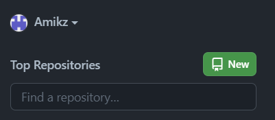

3. Give your repository a name. This can be anything you want, but should be descriptive.
4. Be sure that your repository is set to **Public**
5. Tick the checkbox for **Add a README file**

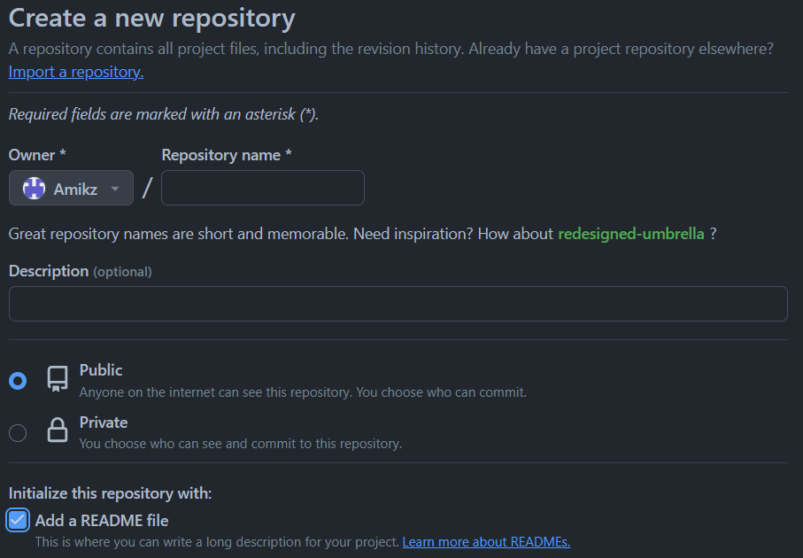

6. Create the repository
7. Click **Code** to open a dropdown, and copy the given link

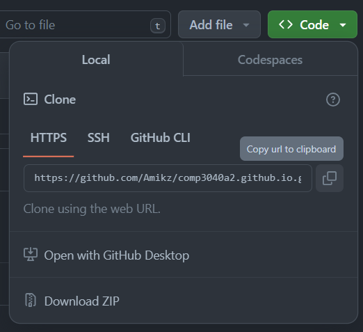

### Cloning the Repository in Git Ahead
1. Open Git Ahead
2. Click **Clone a Repository**
3. Paste the link you copied in step 7 of **Creating a GitHub Repository**

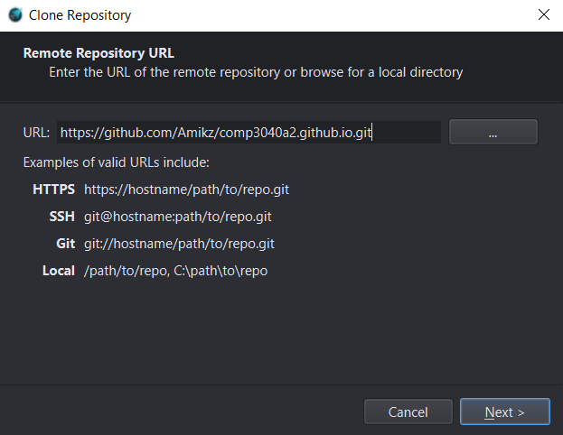

4. Choose the location on your computer to save the repository
5. Click **Clone**

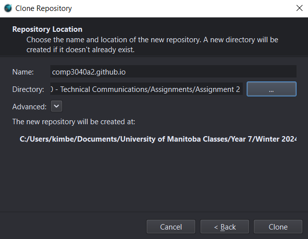

### Adding your Resume Using Git Ahead
1. Write your resume using Markdown in Visual Studio Code and put it in the folder of your GitHub repository
2. Ensure that your resume is named "index.md"
3. In Git Ahead, click **Uncommitted Changes**

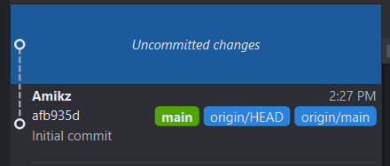

4. Click **Stage All**

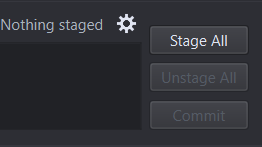

5. Click **Commit**

6. Click the **Push** button on the top left (it will have a red "1" on it)

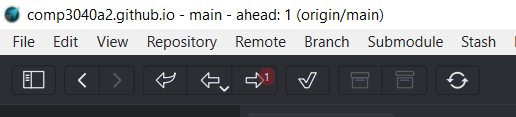

### Hosting your Resume on GitHub Pages
1. In GitHub, go to **Settings** > **Pages**
2. Under **Source**, select **Main**
3. Wait for GitHub to finish building your website
4. Refresh the page and click the provided link to your website

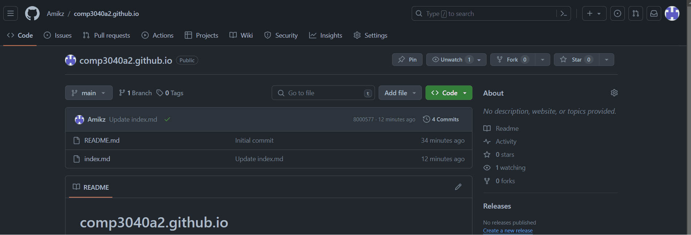

### Styling Your Resume with Jekyll
1. In Visual Studio Code, create a new file called "_config.yml"

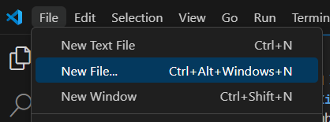

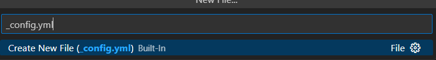

2. In the _config.yml file, type "theme: jekyll-theme-modernist"

    - Alternatively, replace "modernist" with a theme of your choice. A link to the list of Jekyll themes that are supported by GitHub can be found under [More Resources](#more-resources)

3. In Git Ahead, stage, commit, and push the changes (see [Adding your Resume Using Git Ahead](#adding-your-resume-using-git-ahead) steps 3-6)

4. Refresh the GitHub Pages link that is hosting your resume to see the changes
    - It might take a little while for the changes to appear

## More Resources

- [Markdown Tutorial](https://www.markdowntutorial.com/)
- More information on [adding a Jekyll theme](https://docs.github.com/en/pages/setting-up-a-github-pages-site-with-jekyll/adding-a-theme-to-your-github-pages-site-using-jekyll)
- GitHub Pages supported [Jekyll themes](https://pages.github.com/themes/)
- Instructions for [creating a GitHub account](https://docs.github.com/en/get-started/start-your-journey/creating-an-account-on-github)
- Download for [Visual Studio Code](https://code.visualstudio.com/) installer for Windows
- Download for [Git Ahead](https://gitahead.github.io/gitahead.com/) installer for Windows

## Authors and Acknowledgements

This tutorial was written by Kimberly Wills ([Amikz](https://github.com/Amikz))

Modernist Jekyll theme by [tsusdere](https://github.com/pages-themes/modernist) on GitHub

*Modern Technical Writing* by Andrew Etter

## FAQs

Q: Why is Markdown better than a word processor?  
A: Markdown allows for simple formatting 

Q: Why is my resume not showing up?  
A: 