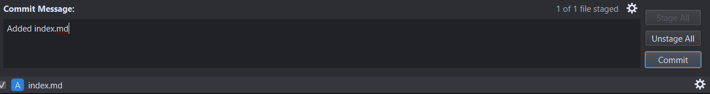

# COMP3040 A2 - Hosting a Resume on GitHub Pages

## Purpose

This GitHub repository acts as a tutorial for hosting a resume on GitHub Pages, and formatting it with Jekyll. The principles used in this tutorial are inspired by _Modern Technical Writing_ by Andrew Etter.

## Prerequisites

-   A resume written in Markdown (see [More Resources](#more-resources) for tutorial on how to write in Markdown).
-   A text editor, such as [Visual Studio Code](https://code.visualstudio.com/), which will be used to write the resume.
-   A [GitHub account](https://docs.github.com/en/get-started/start-your-journey/creating-an-account-on-github).
-   A Git client, such as [Git Ahead](https://gitahead.github.io/gitahead.com/).

## Instructions

The following instructions will show you how to:

1. Create a GitHub repository
2. Clone the GitHub repository
3. Add your resume to the GitHub repository
4. Host your resume using GitHub Pages
5. Style your resume using Jekyll

These instructions are written under the assumption that you have met all of the [Prerequisites](#prerequisites) described above.

The process and prerequisites for this task were chosen to align with Andrew Etter's principles in _Modern Technical Writing_. Etter recommends writing in a lightweight markup language, using a distributed version control system, and hosting a static website using a static site generator. For this tutorial, Markdown was chosen as the lightweight markup language, GitHub was chosen as the distributed version control, and GitHub Pages with Jekyll was chosen to host and format the static webpage.

### Step 1: Create a GitHub Repository

GitHub is a distributed version control system (DVCS). As Etter explains in his book, DVCSs are very useful because they allow for multiple people to work on the same file, for work to be done from any computer, and for the work to be done offline. A "repository" on GitHub is the location where all of your files are stored remotely. In order to make changes, you "clone" the repository to your local computer. This makes a local copy on your computer where changes can be made.

Here are the steps for creating a GitHub repostory:

1. Log in to your [GitHub](https://github.com/) account.

2. Click the **New Repository** button.

3. Give your repository a name. This can be anything you want, but should be descriptive. It should end with ".github.io", so that the name format is "name.github.io".

4. Ensure that your repository is set to **Public**.

5. Tick the checkbox for **Add a README file**.

6. Click **Create Repository**.
    - You will be redirected to the repository page.

### Step 2: Clone the Repository in Git Ahead

The following steps will show you how to clone your repository. As mentioned above, this will make a local copy so that changes can be made offline.

1. In GitHub, click the green **Code** button to open a dropdown

2. Copy the link that appears under **HTTPS**.

3. Open Git Ahead.

4. Click **Clone repository**.

5. Paste the link you copied in step 2.

6. Choose the location on your computer to save the repository.

7. Click **Clone**.

### Step 3: Add Your Resume Using Git Ahead

These steps will show you how to copy the resume you have written on your computer into the GitHub repository so that it can be hosted online.

1. Write or copy/paste your resume into the folder of your GitHub repository.

2. Ensure that your resume is named "index.md".

3. In Git Ahead, click **Uncommitted Changes**.

4. Click **Stage All**.

5. Click **Commit**.

6. Click the **Push** button on the top left (it will have a red "1" on it).

### Step 4: Host Your Resume on GitHub Pages

Now that your resume has been successfully added to GitHub, it is time to host it as a static webpage. GitHub offers a service called "GitHub Pages", which can be used to host your resume as a static webpage. The use of a static webpage is recommended by Etter in _Modern Technical Writing_ because static websites are fast, simple, secure, and easily accessible.

The following steps will explain how to host your resume using GitHub Pages.

1. In your GitHub repository, go to **Settings** > **Pages**.

2. Under **Source**, select **Main**.

3. Wait for GitHub to finish building your webpage.

    - Refresh the page after a little while to check whether it is done. Repeat as necessary. When your webpage is ready, GitHub Pages will provide the link.

4. Click the provided link to your webpage.

### Step 5: Style Your Resume with Jekyll

At this point in the tutorial, you should be able to see your webpage. However, it will be pretty bland, as no styling has been made at this point. To style and format your static webpage, a static site generator is used.

These steps will show you how to format your resume webpage using Jekyll as a static site generator.

1. In Visual Studio Code, create a new file called "\_config.yml".

2. In the \_config.yml file, type "theme: jekyll-theme-modernist".

    - Alternatively, replace "modernist" with a theme of your choice. A link to the list of Jekyll themes that are supported by GitHub can be found under [More Resources](#more-resources).

3. Push your changes using Git Ahead (see [Step 3: Add Your Resume Using Git Ahead](#step-3-add-your-resume-using-git-ahead), steps 3-6).

4. Refresh the GitHub Pages link that is hosting your resume to see the changes.
    - It might take a little while for the changes to appear.

## More Resources

-   [Markdown Tutorial](https://www.markdowntutorial.com/)
-   More information on [adding a Jekyll theme](https://docs.github.com/en/pages/setting-up-a-github-pages-site-with-jekyll/adding-a-theme-to-your-github-pages-site-using-jekyll)
-   GitHub Pages supported [Jekyll themes](https://pages.github.com/themes/)
-   Instructions for [creating a GitHub account](https://docs.github.com/en/get-started/start-your-journey/creating-an-account-on-github)
-   Download for [Visual Studio Code](https://code.visualstudio.com/) installer for Windows
-   Download for [Git Ahead](https://gitahead.github.io/gitahead.com/) installer for Windows

## Authors and Acknowledgements

This tutorial was written by Kimberly Wills ([Amikz](https://github.com/Amikz)).

Modernist Jekyll theme by [tsusdere](https://github.com/pages-themes/modernist) on GitHub.

Principles used in this guide from _Modern Technical Writing_ by Andrew Etter.

## FAQs

Q: Why is Markdown better than a word processor?  
A: Markdown isn't _inherently_ better than a word processor. However, it is the better option for hosting your resume on a webpage. Markdown is well-suited for making a static webpage. It is very simple and doesn't include all of the features of a word processor. When these features are not needed, it is much faster and easier to simply use Markdown and style it with Jekyll than to use a word processor.

Q: Why is my resume not showing up?  
A: There are several reasons why this may be the case. Firstly, GitHub might not have finished setting up your resume webpage. If this is the case, you should see a yellow circle on your GitHub repository. In this case, just wait for a little bit longer and then refresh the webpage. Otherwise, you may have missed a step or made a mistake during the setup.

Here is a list of things to check:

-   Is the resume file titled "index.md"?
-   Is the GitHub repository named in the format "name.github.io"?
-   In **Settings** > **Pages**, is the **Branch** set to **main**?
-   Are you using the correct link?
    -   You can find the link in **Settings** > **Pages**
